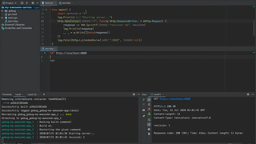
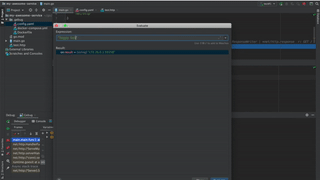
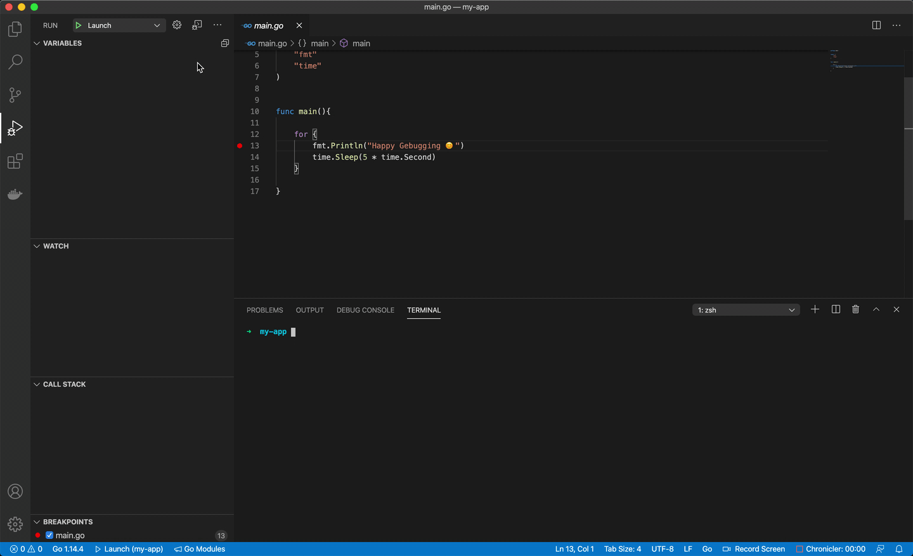

A tool that makes debugging of Dockerized Go applications super easy by enabling Debugger and Hot-Reload features, seamlessly.  


[](https://codecov.io/gh/moshebe/gebug)
[](https://pkg.go.dev/github.com/moshebe/gebug)
[](https://goreportcard.com/report/github.com/moshebe/gebug)
[](https://opensource.org/licenses/Apache-2.0)
---
# Installation
### [Homebrew](https://brew.sh/) (Linux/macOS)
```shell
brew install gebug
```
### [Go](https://golang.org) (Linux/Windows/macOS/any other platform supported by Go)
If you have Go 1.16+, you can install latest released version of `gebug` directly from source by running:
```shell
go install github.com/moshebe/gebug@latest
```

# Usage
```
➜ gebug --help
Gebug helps you setup a fully suited debugging environment of Go application running inside a container.
It enables options like connecting with remote debugger and breakpoints inside the code or 
use hot-reload features which auto-build and run upon new change detected on the source code.

Usage:
  gebug [command]

Available Commands:
  clean       Clean Gebug stack
  destroy     Destroy the Gebug project
  help        Help about any command
  init        Initialize a Gebug project
  start       Start Gebug services
  ui          Start Gebug web UI
  version     Gebug's version

Flags:
  -h, --help             help for gebug
  -v, --verbose          enable verbose mode
  -w, --workdir string   your Go application root directory (default ".")

Use "gebug [command] --help" for more information about a command.
```

# Demo
#### Configure workspace for Hot-Reload


#### Goland Debugger


#### Visual Studio Code Debugger



# How Does It Work

Nothing special, no voodoo. Gebug just handles the Dockerfile and docker-compose configuration files generation with a easy-to-use command line utility.    
You can find the generated files in your project under `.gebug` directory.  
We are all programmers and I know you like to play with your toys, so feel free to edit any of those files in order to fit your use-case. 
Just make sure to run `gebug start --skip-generate` so the next run won't override your changes.

Let's examine the `config.yaml` fields so you will feel more comfortable editing as you wish:

| Field            	| Default                          	    | Description                                                                                                                                                                                                                             	|
|------------------	|---------------------------------------|-----------------------------------------------------------------------------------------------------------------------------------------------------------------------------------------------------------------------------------------	|
| name             	|                                	    | application/project name                                                                                                                                                                                                                	|
| output_binary    	| /app                           	    | output binary artifact inside the runtime container                                                                                                                                                                                     	|
| build_command    	| go build -o {{.output_binary}}  	    | build command inside the runtime container.  Note you can reference other configuration fields. When enabling Debugger `-gcflags="all=-N -l"` will be appended  to the build command to stop compiler optimization and symbol removing 	|
| run_command      	| {.output_binary}}              	    | run command, probably most of the time will just be the binary artifact path                                                                                                                                                            	|
| runtime_image    	| golang:1.18                    	    | base Docker image for the runtime container                                                                                                                                                                                             	|
| debugger_enabled 	| false                            	    | whether to enable delve debugger inside the container or just use hot-reload                                                                                                                                                            	|
| debugger_port    	| 40000                            	    | delve debugger listen port, relevant only if `debugger_enabled` was set                                                                                                                                                                 	|
| expose_ports     	| []                               	    | list of ports to expose inside the container. Uses the same syntax as docker-compose for mapping between host and container ports(e.g: "8080:8080"). No need to add the delve debugger listen port as it will be auto-added            	|
| networks     	    | []                               	    | list of docker external networks to join. if no network is selected, a new one will be created                                                                                                                                            |
| environment     	| []                               	    | list of environment variables to be set inside the container. Syntax: `FOO=BAR` or just `FOO` which will take the variable `FOO` from host and set it with its value                                                                      |

# Web UI
If you prefer a web interface over a terminal or YAML file, you can simply run the following command in your Gebug project directory
```
gebug ui
``` 
A simple web application will be opened and let you control the Gebug configuration of your project directly from your browser.  


 
# License
Gebug is released under the Apache 2.0 license. See LICENSE.


